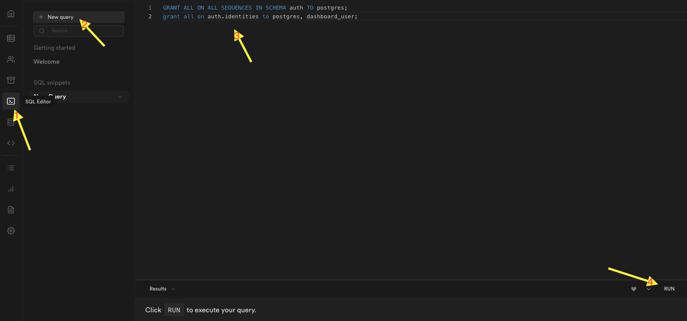

# Supabase with Edge Functions Project Generator Template

## What are Supabase Edge Functions?

[Supabase Edge Functions](https://supabase.com/edge-functions) are written in TypeScript, run via Deno, and deployed with the Supabase CLI. Please [download](https://github.com/supabase/cli#install-the-cli) the latest version of the Supabase CLI, or [upgrade](https://github.com/supabase/cli#install-the-cli) it if you have it already installed.

## Setup

- Editor: Visual Studio Code + Deno extension
### Supabase CLI

- `Docker` is required to run Supabase in local
- Following the [guide](https://supabase.com/docs/reference/cli/installing-and-updating) to install
- Stop all docker previous running containers before starting new supabase: `./bin/docker_clean.sh`
- Create 2 env files: `.env.local` and `.env` representing for `local` and `prod` in root folder, add these variables into:
    ```
    SP_URL=xxxx
    API_URL=xxxx
    DB_URL=xxxxx
    ANON_KEY=xxxxx
    SERVICE_ROLE_KEY=xxxxx
    GOOGLE_CLIENT_ID=xxxxx
    GOOGLE_CLIENT_SECRET=xxxxx
    FACEBOOK_CLIENT_ID=xxxxx
    FACEBOOK_CLIENT_SECRET=xxxxx
    PROJECT_ID=xxxx
    ```
- Initialize Supabase CLI:
    - Login: `supabase login`
    - Grant permission for up file: `chmod -R +x bin`
    - Find <org_id>: `supabase orgs list`
    - Up the env: `./bin/up.sh <project_name> <org_id> <db_password>`

- Start Supabase instance in local: `./bin/start.up`, copy the output:
    - Replace *ANON_KEY* and *SERVICE_ROLE_KEY* values to corresponding fields in .env files
    - For DB_URL field in `.env.local`, just replace the value from output to `.env.local`

- Deploy the project: `./bin/deploy.sh`
- Remove *xxxx_remote_commit.sql* in folder **migrations** after deployed successfully

### Enable Auth with Providers: Google, Facebook,...
- Access site: https://app.supabase.com
- Open the preceding project
- Choose  on the left menu
- Choose 
- Scroll down to find the target provider, click the down arrow to expand
- Switch  -> Enter `Client ID` and `Client Secret`

### Local Development
- Start supabase instance: `./bin/start.sh`

### DB and APIs development and deployment
- Creat new migration: `supabase migration new <migration-new>`
- Add SQL queries: create [tables](https://supabase.com/docs/guides/database/tables), policies (RLS), triggers, [functions](https://supabase.com/docs/guides/database/functions) -> Following the `migrations/xxxx-initial.sql` file
- [Deploy](#36) the project will automatically sync these SQLs to the cloud

### Edge Functions development and deployment
- Create a function: `supabase functions new <function-name>`
- Implement the logics inside folder `<function-name>/index.ts`, following profiles_public folder.
- Serve a function: `supabase functions serve <function-name>`
- Do testing the function by using curl or supabase-js invoke function
- Deploy to cloud: `supabase functions deploy <function-name>`

### Version Control


### Additional Configurations
- Update  to `app-url-scheme` for mobile scheme redirect url if aiming to integrate this supabase app for the applications

### Migrate database to new project
- Deploy a new project following the preceding sections
- Intall [Postgres](https://www.postgresql.org/download/)
- Follow [these steps](https://supabase.com/docs/guides/database#migrate-the-database) to do migration
- [Migrate Storage objects](https://supabase.com/docs/guides/database#migrate-storage-objects)
- Known-issues:
  - `pg_dump` command produces an error: **query failed: ERROR:  permission denied**:
    - Run these commands on  of old project:
    ```
    GRANT ALL ON ALL SEQUENCES IN SCHEMA auth TO postgres; 
    grant all on auth.identities to postgres, dashboard_user;
    ```